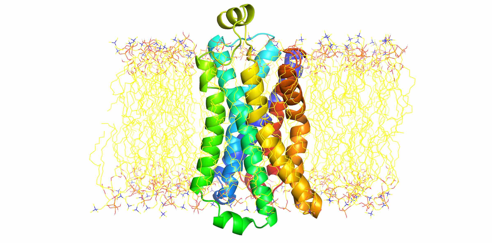

## Files

* The initial membrane protein PDB file [`apo_snapshot.pdb`](files/apo_snapshot.pdb) comes from reference structures provided in [Kohloff et.al. 2014](http://www.nature.com/nchem/journal/v6/n1/full/nchem.1821.html),
originally from [PDB ID: 3POG](http://www.rcsb.org/pdb/explore.do?structureId=3p0g).
* A tarball of the CHARMM-GUI output can be found in [`charmm-gui.zip`](files/charmm-gui.zip)

## Using CHARMM-GUI to embed B2AR in a solvated membrane

1. Go to [CHARMM-GUI's membrane builder](http://www.charmm-gui.org/?doc=input/membrane) and upload the pdb file.
(`apo_snapshot.pdb`). Select PDB format and click `Next Step`.
2. Stick with the default selection (Protein) and click `Next Step`.
3. Select `Terminal group patching` and select termin `NTER` and `CTER`.
4. Select `Disulfide bonds` for the pairs `184-190` and `106-191` and click `Next Step`.
5. Select `Align the First Principal Axis Along Z` (the suggestion for a homo-oligomer) and click `Next Step`.
6. Keep the default selections for `Heterogeneous Lipid`, `Rectangular` Box Type, `17.5 water thickness`. Select
`Number of lipid components` and select `POPC` lipids with `55` lipids on the upperleaflet and lowerleaflet. Clike
`Next Step`.
7. Keep all default selections (`Replacement method`, `check lipid ring (and protein surface) penetration`,
`Include Ions 0.15 KCl` and `Ion Placing Method: Monte-Carlo`. Click `Next Step`.
8. Click `Next Step` to assemble components. When you arrive at `Step 5`, select `OpenMM` as the Input generation
option. Keep all the other default options (`Generate grid information for PME FFT automatically` and `NPT ensemble`.
Click `Next Step`.



## Simulating the system in OpenMM

### The quick way

From the `charmm-gui.tgz` extract `toppar/` directory and the `openmm/` directory. The `README` file in the `openmm/` directory is a `csh` script to run a standard equilibration and production simulation.

### The flexible way

If you want finer control, you can write your own OpenMM code to equilibrate and simulate the system.

OpenMM can directly read CHARMM input files through the use of the [`simtk.openmm.app`](http://docs.openmm.org/7.1.0/api-python/app.html) application layer.
This enables the use of all the powerful setup tools in the CHARMM ecosystem that a user might be familiar with such as the [CHARMM-GUI](http://onlinelibrary.wiley.com/doi/10.1002/jcc.20945/abstract), [VMD](http://www.sciencedirect.com/science/article/pii/0263785596000185?via%3Dihub), [CGenFF program](https://cgenff.paramchem.org/) (DOI:[10.1002/jcc.21367](http://onlinelibrary.wiley.com/doi/10.1002/jcc.21367/abstract)), etc.
This allows users who are already working in the CHARMM environment to harness the GPU speeds that OpenMM provides without having to modify their simulation system description files.

OpenMM can also read CHARMM force field files making it is possible to use force fields that aren't already included in OpenMM such as the general CHARMM force field (CGenFF). For example, a user can generate an `str` file with the [CGenFF program](https://cgenff.paramchem.org/) for a ligand and load it into OpenMM. However, when using this feature, the [`CharmmParameterSet`](http://docs.openmm.org/7.1.0/api-python/generated/simtk.openmm.app.charmmparameterset.CharmmParameterSet.html#simtk.openmm.app.charmmparameterset.CharmmParameterSet) class needs to be used instead of the [`ForceField`](http://docs.openmm.org/7.1.0/api-python/generated/simtk.openmm.app.forcefield.ForceField.html#simtk.openmm.app.forcefield.ForceField) class to load all the other CHARMM force field files as demonstrated in the example in Listing 1.


The example demonstrates how to use CHARMMM files that were generated with the CHARMM-GUI in an OpenMM script.
The OpenMM app layer includes several classes to load CHARMM files.
The [`CharmmPsfFile`](http://docs.openmm.org/7.1.0/api-python/generated/simtk.openmm.app.charmmpsffile.CharmmPsfFile.html#simtk.openmm.app.charmmpsffile.CharmmPsfFile) class reads the `psf` file and instantiates a chemical structure on
which one can then call the [`createSystem()`](http://docs.openmm.org/7.1.0/api-python/generated/simtk.openmm.app.charmmpsffile.CharmmPsfFile.html#simtk.openmm.app.charmmpsffile.CharmmPsfFile.createSystem) method to creates an OpenMM system object. For the atomic coordinates, a regular `pdb` file can be used or the [`CharmmCrdFile`](http://docs.openmm.org/7.1.0/api-python/generated/simtk.openmm.app.charmmcrdfiles.CharmmCrdFile.html#simtk.openmm.app.charmmcrdfiles.CharmmCrdFile) or [`CharmmRstFile`](http://docs.openmm.org/7.1.0/api-python/generated/simtk.openmm.app.charmmcrdfiles.CharmmRstFile.html#simtk.openmm.app.charmmcrdfiles.CharmmRstFile) classes can be used to read CHARMM coordinate files.
Files containing force field definitions come in a variety of formats such as `prm`, `par`, `top`, `rtf`, `inp` and `str`.
These files are loaded into a `CharmmParameterSet` object which is then included as the first parameter when [`createSystem()`](http://docs.openmm.org/7.1.0/api-python/generated/simtk.openmm.app.charmmpsffile.CharmmPsfFile.html#simtk.openmm.app.charmmpsffile.CharmmPsfFile.createSystem) is called on the chemical structure. For this example, the [membrane builder](http://dx.doi.org/10.1371/journal.pone.0000880) in the CHARMM-GUI was used
to generate the input files for the B2AR in a POPC lipid membrane.
The membrane builder provides a straightforward way to go from the RCSB X-ray structure to the protein embedded in a membrane with all the relevant CHARMM input
files.
```python
from simtk.openmm.app import *
from simtk.openmm import *
from simtk.unit import *
from sys import stdout, exit, stderr

# Load CHARMM files
psf = CharmmPsfFile('step5_charmm2omm.psf')
pdb = PDBFile('step5_charmm2omm.pdb')
params = CharmmPsfFile('par_all36_prot.rtf', 'top_all36_prot.prm',
                       'par_all36_lipid.rtf', 'top_all36_lipid.prm',
                       'toppar_water_ion.str')

# Create an openmm system by calling createSystem on psf
system = psf.createSystem(params, nonbondedMethod=NoCutoff,
         nonbondedCutoff=1*nanometer, constraints=HBonds)
integrator = LangevinIntegrator(300*kelvin,   # Temperature of head bath
                                1/picosecond, # Friction coefficient
                                0.002*picoseconds) # Time step

simulation = Simulation(psf.topology, system, integrator)
simulation.context.setPositions(pdb.positions)
simulation.minimizeEnergy()

# Set up the reporters to report energies every 1000 steps.
simulaiton.reporters.append(PDBReporter('output.pdb', 1000))
simulation.reporters.append(StateDataReporter(stdout, 1000, step=True,
                            potentialEnergy=True, temperature=True))
# run simulation
simulation.step(10000)

```
The CHARMM-GUI also generates a more elaborate set of OpenMM scripts to run equilibration and the production simulation that are very straightforward to use (see "The quick way" above).
When OpenMM is selected in the last step, CHARMM-GUI provides all the
relevant OpenMM scripts in the downloaded tarball.
The parameters and arguments for OpenMM objects and functions are provided in the `inp` files for all equilibration steps and production.
This makes it simple to change parameters such as the time-step or electrostatic cut-off method.
